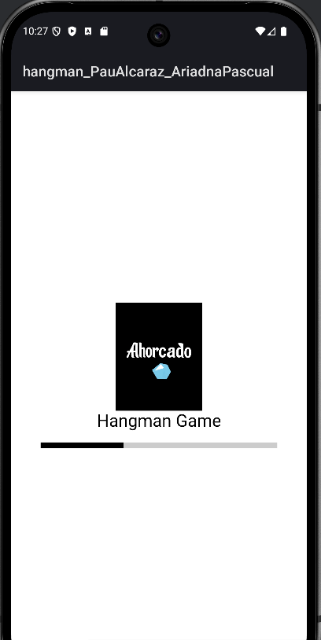
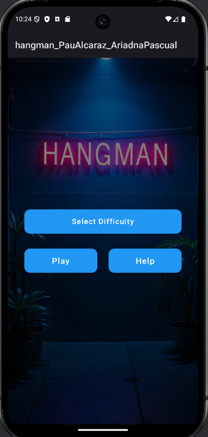
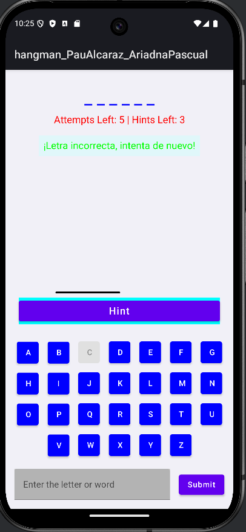
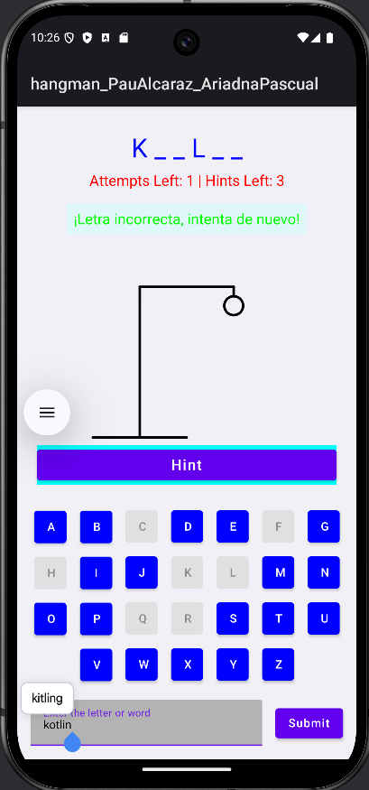
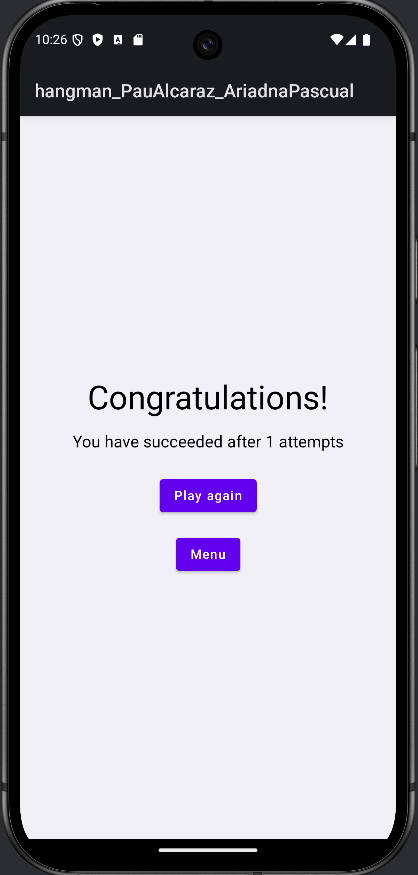
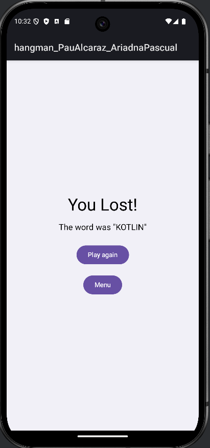

# Hangman Game - Kotlin + Jetpack Compose

## 📚 Descripción
Este es un proyecto de un **juego del ahorcado** desarrollado en **Kotlin** utilizando **Jetpack Compose** para la interfaz de usuario. El objetivo del juego es adivinar la palabra antes de que se complete el dibujo del ahorcado. Incluye funcionalidades como selección de dificultad, pistas y control de intentos restantes.

## 🚀 Características
- **Interfaz moderna y adaptativa** gracias a Jetpack Compose.
- **Selección de dificultad**:
  - **Fácil**: Palabras cortas y simples.
  - **Media**: Palabras de longitud media y mayor complejidad.
  - **Difícil**: Palabras largas y técnicas relacionadas con programación.
- **Pistas**: Los jugadores pueden obtener hasta 3 pistas para descubrir letras de la palabra.
- **Teclado virtual**: Botones interactivos para seleccionar letras.
- **Animación del ahorcado**: Un dibujo que se completa con cada error.
- **Pantallas de resultados**:
  - Ganador 🎉
  - Perdedor 😢

### 📁 Directorios principales
- **`model/`**: Definición de estructuras de datos, si es necesario.
- **`viewModel/`**: Lógica del juego y manejo de estados (`GameViewModel.kt`).
- **`views/`**: Interfaces de usuario distribuidas por pantallas:
  - `LaunchScreen`: Pantalla de bienvenida.
  - `Screen1`: Selección de dificultad y menú principal.
  - `GameScreen`: Pantalla del juego principal.
  - `ResultScreen`: Pantallas de resultado (`WinnerScreen` y `LoserScreen`).

## 🎮 Cómo jugar
1. Selecciona una **dificultad** en el menú principal.
2. Presiona el botón **Play** para comenzar.
3. Adivina la palabra seleccionando letras en el teclado virtual.
4. Utiliza las **pistas** sabiamente para revelar letras si te quedas atascado.
5. Si completas la palabra antes de que se termine el dibujo del ahorcado, ¡ganas! De lo contrario, pierdes.

## 🖼️ Capturas de pantalla
### Pantalla de inicio (LaunchScreen)

### Pantalla de selección de dificultad (Screen1)

### Pantalla del juego (GameScreen)

### Pantalla de resultados (ResultScreen)

## 🛠️ Requisitos
- **Android Studio**: Para ejecutar y modificar el proyecto.
- **Kotlin 1.8 o superior**.

## ✨ Próximas mejoras
- Añadir más niveles de dificultad.
- Implementar un sistema de puntuación.
- Soporte para múltiples idiomas.
- Mejora de la interfaz con animaciones adicionales.

## 🤝 Contribuciones
¡Contribuciones son bienvenidas! Si quieres colaborar:
1. Haz un fork del proyecto.
2. Crea una nueva rama: `git checkout -b feature/nueva-funcionalidad`.
3. Haz un commit de tus cambios: `git commit -m 'Añadida nueva funcionalidad'`.
4. Haz un push a la rama: `git push origin feature/nueva-funcionalidad`.
5. Abre un Pull Request.

